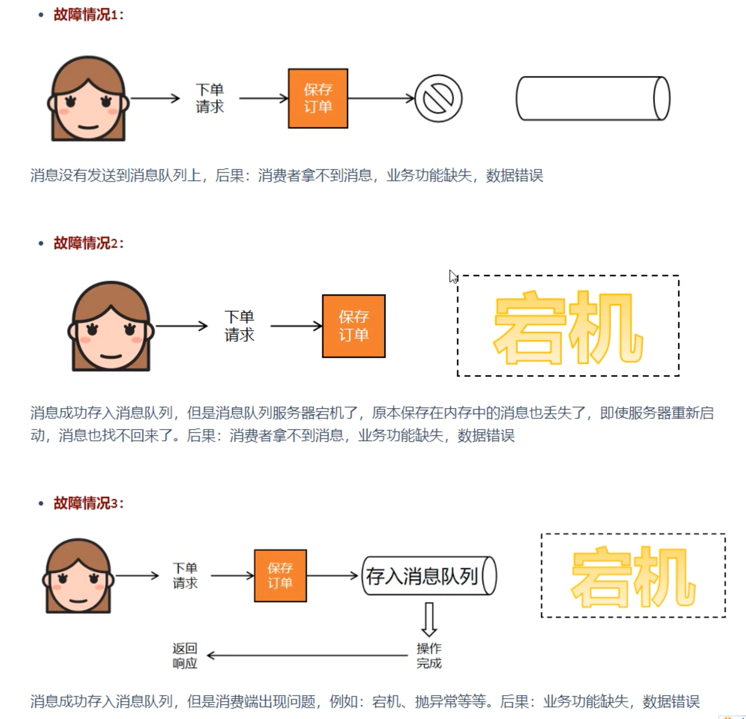
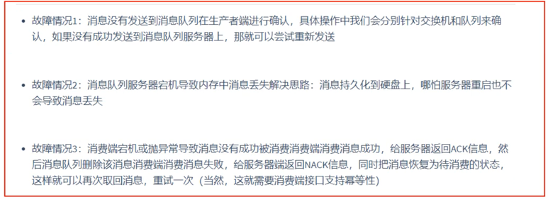
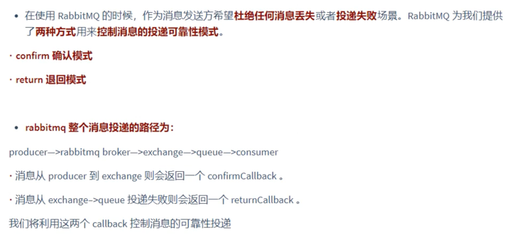
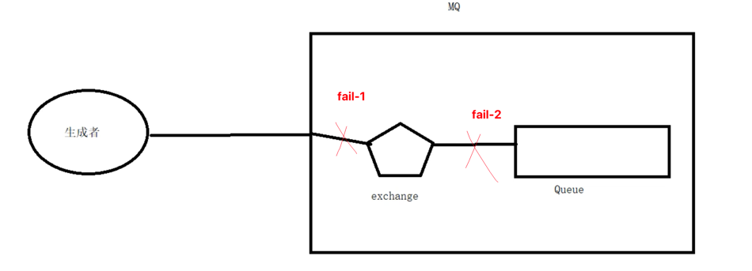
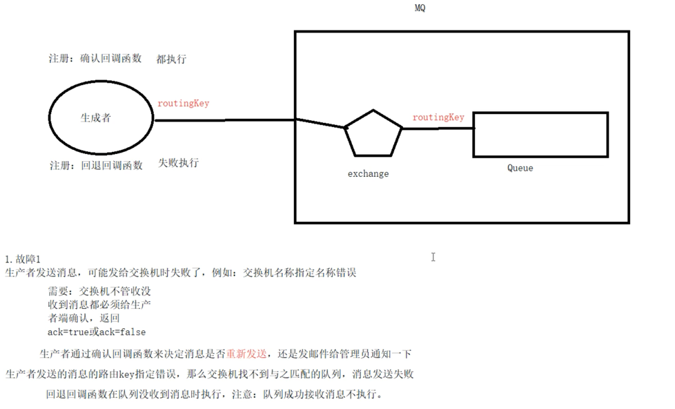

# 消息可靠性投递

## 1. 概述

### 1.1 问题引入

### 1.2 解决方案

## 2. 故障1解决: 生产者端消息确认机制

### 2.1 概念

1. 故障1:
    生产者发送消息,可能发给交换机时失败了,例如:交换机名称指定名称错误
        
        需要 : 交换机不管收没收到消息都必须给生产者端确认,返回ack=true或ack=false
        生产者通过确认回调函数来决定消息是否重新发送,还是发邮件给管理员通知一下
    生产者发送的消息的路由key指定错误,那么交换机找不到与之匹配的队列,消息发送失败.

        回退回调函数在队列没收到消息时执行,注意:队列接收到消息不执行.
