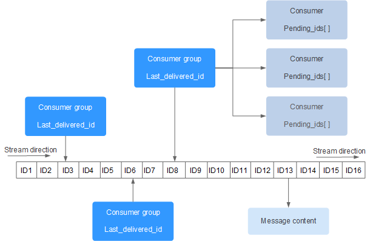
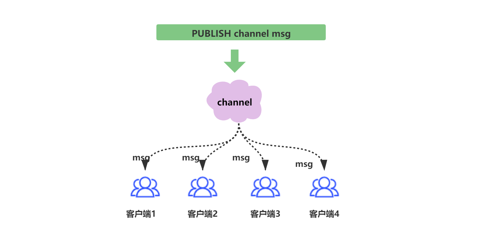

# 一、redis stream

引入redis  stream:
    
## 1.1 首先理解它的出现背景?

Redis Stream 是 **Redis 5.0** 版本新增加的**数据结构**。

Redis Stream 主要用于**消息队列**（MQ，Message Queue），
Redis 本身是有一个 Redis 发布订阅 (pub/sub) 来实现消息队列的功能，
但它有个缺点就是**消息无法持久化**，如果出现网络断开、Redis 宕机等，消息就会被丢弃。

简单来说发布订阅 (pub/sub) 可以分发消息，但无法记录历史消息。

而 Redis Stream **提供了消息的持久化和主备复制功能**，可以让任何客户端访问任何时刻的数据，
并且能记住每一个客户端的访问位置，还能保证消息不丢失。

Redis Stream 的结构如下所示，它有一个消息链表，将所有加入的消息都串起来，每个消息都有一个唯一的 ID 和对应的内容:

每个 Stream 都有唯一的名称，它就是 Redis 的 key，在我们首次使用 xadd 指令追加消息时自动创建。

上图解析：
- Consumer Group ：消费组，使用 XGROUP CREATE 命令创建，一个消费组有多个消费者(Consumer)。
- last_delivered_id ：游标，每个消费组会有个游标 last_delivered_id，任意一个消费者读取了消息都会使游标 last_delivered_id 往前移动。
- pending_ids ：消费者(Consumer)的状态变量，作用是维护消费者的未确认的 id。 pending_ids 记录了当前已经被客户端读取的消息，但是还没有 ack (Acknowledge character：确认字符）。

# 二、Redis 实现消息队列

上一章节,介绍到 Redis Stream的出现,是为了给 Redis 提供了完善的消息队列.

其实,基于redis的消息队列有很多种实现方式:
- 基于 Redis 发布订阅 (pub/sub)
- 基于 Redis 列表 (list) 的LPUSH + BRPOP
- 基于有序集合的实现

  | 类型         | 	优点         | 	缺点                                                 |
  |------------|-------------|-----------------------------------------------------|
  | List       | 	支持阻塞式的获取消息 | 	没有消息多播功能，没有ACK机制，无法重复消费等等                          |
  | Pub/Sub    | 	支持消息多播     | 	消息无法持久化，只管发送，如果出现网络断开、Redis宕机等，消息就直接没了，自然也没有ACK机制。 |
  | Sorted Set | 	支持延时消息     | 	不支持阻塞式获取消息、不允许重复消费、不支持分组。                          |

# 三、 发布订阅模式

Redis 发布订阅 (pub/sub) 是一种消息通信模式：发送者 (pub) 发送消息，订阅者 (sub) 接收消息。

当发布者向channel中发送消息时,所有的订阅了channel的客户端都会收到消息.

- 订阅者首先订阅channel
- 发布者发布消息
- 订阅者收到消息

**致命的缺陷:**
- 消息无法持久化

Redis的发布订阅模式,消息无法持久化,没有实现持久化机制的Pub/Sub,
无法做到消息的不丢失,在客户端宕机或者Redis服务宕机的情况下,都会导致消息的丢失.

# 四、 Stream
Stream弥补了Redis作为消息队列技术选型上的不足之处。

Redis 5.0发布的Stream相比Pub/Sub模块，Stream支持消息持久化，结合集群使其成为了一个比较可靠的消息队列。

**Stream 实现的功能包括如下：**

1. 提供了消息多播的功能，同一个消息可被分发给多个单消费者和消费者组

2. 提供了消息持久化的功能，可以让任何消费者访问任何时刻的历史消息

3. 提供了对于消费者和消费者组的阻塞、非阻塞的获取消息的功能

4. 提供了强大的消费者组的功能：

- 消费者组实现同组多个消费者并行但不重复消费消息的能力，提升消费能力；
- 消费者组能够记住最新消费的信息，保证消息连续消费；
- 消费者组提供了ACK确认机制，保证消息被成功消费，不丢失；

# 五、 备注

**使用场景:**
- 消息消费: 在Redis Stream 消费者轮询中调用
- 业务处理: 执行具体的业务逻辑处理
- 异常处理: 需要包含适当的异常捕获机制

**注意事项:**
- 幂等性: 确保消息处理过程中没有重复处理。
- 异常处理: 捕获处理过程中的异常(最好记录下异常的消息), 避免中断整个消费流程.
- 确认机制: 处理完成后需要确认消息以待处理列表中移除.

 **集群优势:**
   - 分片支持: Stream 可以跨集群节点分布

   - 高可用: 主从复制保障消息不丢失

   - 持久化: 消息持久存储保障可靠性

   - 消费组: 支持多消费者并行处理

 **配置建议:**
   - 消息过期: 设置适当的 TTL 避免内存溢出

   - 消费者组: 合理规划消费者组以实现负载均衡

   - 阻塞读取: 使用 XREADGROUP 的 BLOCK 参数提高效率

   - 监控指标: 关注 Stream 长度和消费延迟

